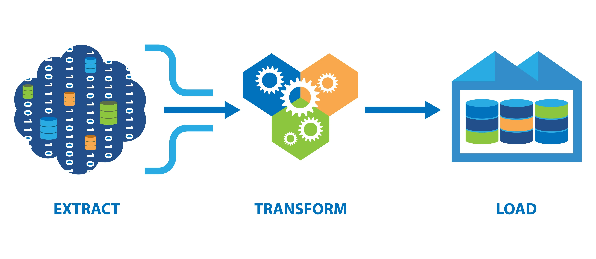
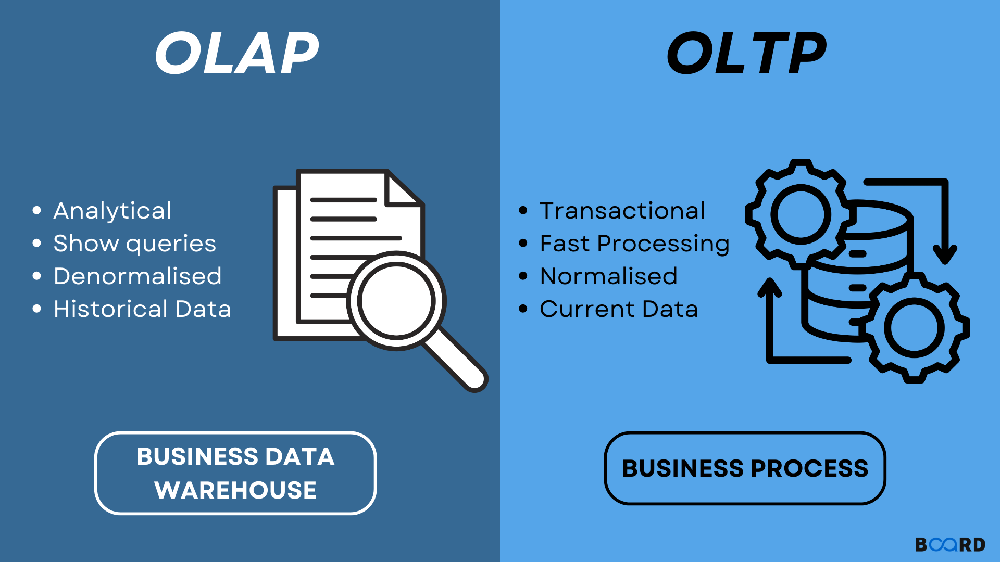

# AdventureWorks

## Rôles des bases de données

- La base de données **AdventureWorks2019** sert à...

## Qu'est-ce que l'ETL ?

1. Extraire **(Extract)** : Dans cette étape, les données sont extraites de différentes sources de données, telles que des bases de données, des fichiers plats, des API web, des services externes, etc. L'extraction peut impliquer des requêtes SQL, des appels d'API, des transferts de fichiers, etc. L'objectif est de récupérer les données brutes à partir des sources.

2. Transformer **(Transform)** : Une fois les données extraites, elles subissent des transformations pour les préparer à être utilisées dans le contexte spécifique du projet. Les transformations peuvent inclure le nettoyage des données, la normalisation, l'agrégation, la fusion, la conversion de formats, la gestion des doublons, etc. L'objectif est de rendre les données cohérentes, complètes et conformes aux besoins du projet.

3. Charger **(Load)** : Après la transformation, les données sont chargées dans une base de données ou un entrepôt de données prêt à l'emploi.Cela peut impliquer l'insertion des données dans des tables, la création de nouvelles tables, la mise à jour des données existantes, etc. L'objectif est de stocker les données de manière structurée et optimisée pour une utilisation ultérieure.

---

## Qu'est ce que OLTP et OLAP ?

L'acronyme **OLAP** signifie **"Online Analytical Processing"**
OLAP est axé sur l'analyse et le traitement des données à des fins de reporting et de prise de décision.

**OLAP** est utilisé pour les tâches d'analyse de données complexes et avancées, telles que:

- L'exploration de données
- La génération de rapports
- La modélisation prédictive
- L'analyse multidimensionnelle.

**OLAP** est souvent utilisé dans les domaines de la business intelligence, de l'analyse financière, du reporting d'entreprise et de la planification stratégique.
Il est conçu pour permettre aux utilisateurs d'interroger et d'analyser de grands ensembles de données à partir de différentes perspectives et dimensions.

---

L'acronyme **OLTP** signifie **"Online Transaction Processing"** (traitement transactionnel en ligne en français). Les données OLTP sont principalement utilisées pour les systèmes de gestion de bases de données transactionnelles où de nombreuses opérations de traitement de transactions sont effectuées.

Lorsqu'il est dit que les données OLTP sont adaptées aux applications qui nécessitent un accès rapide et en temps réel aux données, ainsi qu'à des opérations de traitement transactionnel fréquentes, telles que :

- L'ajout
- La modification
- Ou la suppression de données.

Les systèmes OLTP sont conçus pour répondre aux exigences de performances élevées, de concurrence d'accès aux données et de cohérence transactionnelle. Ils sont couramment utilisés dans les domaines tels que les systèmes de gestion de bases de données en ligne, les applications bancaires, les systèmes de réservation, les applications de commerce, etc.

---

## Qu'est-ce qu'un Data warehouse et un Datalake ?

Pour le Data **warehouse**:

- Il permet de rassembler des données provenant de différentes sources pour obtenir une vue unifiée.
- Il offre des performances élevées lors de l'analyse des données.
- Les utilisateurs peuvent effectuer des analyses approfondies et prendre des décisions basées sur des informations exploitables.
- Il stocke des données sur une longue période pour permettre des analyses historiques.
- Il offre des fonctionnalités de sécurité avancées pour protéger les données sensibles.

---

Pour le Data **lake**:

- Le datalake est un système de stockage qui centralise et stocke de grandes quantités de données brutes, structurées et non structurées.
- Il offre une grande flexibilité pour stocker et analyser des données de diverses sources.
- Il est adapté aux Big Data et permet d'explorer les données sans transformation préalable.
- Il offre des fonctionnalités de sécurité et de contrôle d'accès pour protéger les données.
